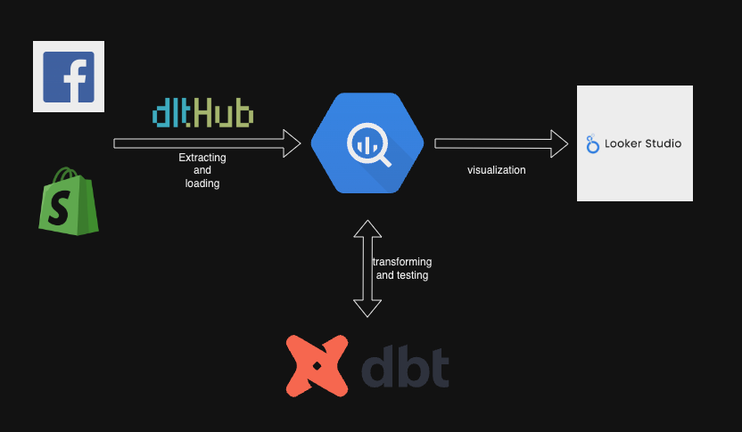

## Objective: 
This project allows you to analyze an ecommerce shop using facebook ads and shopify data.

This project will extract data from the facebook ads api, transform and model the data for analytics and visualize in a dashboard.
Available metrics include CAC, MER and aMER.

### Project Overview:


### dbt data modelling overview:
The transformation in dbt is divided into three stages. 
Staging (stg_) for simple cleaning of source data. 
Intermediate (int_) for applying joins and business logic. 
Marts (mrt_) for tables that are ready for use in the BI layer. These tables are prejoined and aggregated so that this does not need to be done in LookerStudio.
If a different BI tool was used, this layer would contain the dimensional model, e.g. facts and dimension tables.


## How to replicate this project:
### 1. Create a fresh venv and install packages
Create and activate a virtual environment to manage dependencies:  
```bash
python3 -m venv venv  
source venv/bin/activate  # On Windows, use `venv\Scripts\activate`
pip install -r requirements.txt
```

### 2. Create GCP Service Accounts
You will need one for dlt (extraction) and one for dbt (transformation).
Give them these rights:
dlt-service-account:
BigQuery Data Editor,
BigQuery Job User,
BigQuery Read Session User

dbt-service-account:
BigQuery Data Editor,
BigQuery Job User

### 3. Setting up the extraction with dlt
- cd into extraction/facebook_ads
- Fill out the config.example.toml, secrets.example.toml files and rename them to config.toml, secrets.toml.
- run python3 facebook_ads_pipeline.py

### 4. Setting up transformation with dbt
- cd into transformation/
- copy profiles.example.yml to ~.dbt/
- fill out and rename to profiles.yml
- cd into transformation/online_shop_dbt/ and use 'dbt run' command to run all models. 
- Use 'dbt test' to run all tests.

### 5. Visualization
- not included here for privacy reasons

## Further steps:
Further improvements could be made to this project:
- dockerizing the individual parts
- create ci/cd pipeline and run everything in the cloud
- adding an orchestration tool for daily runs
- testing is currently only done in the transformation layer. Testing right in the extraction could be added
